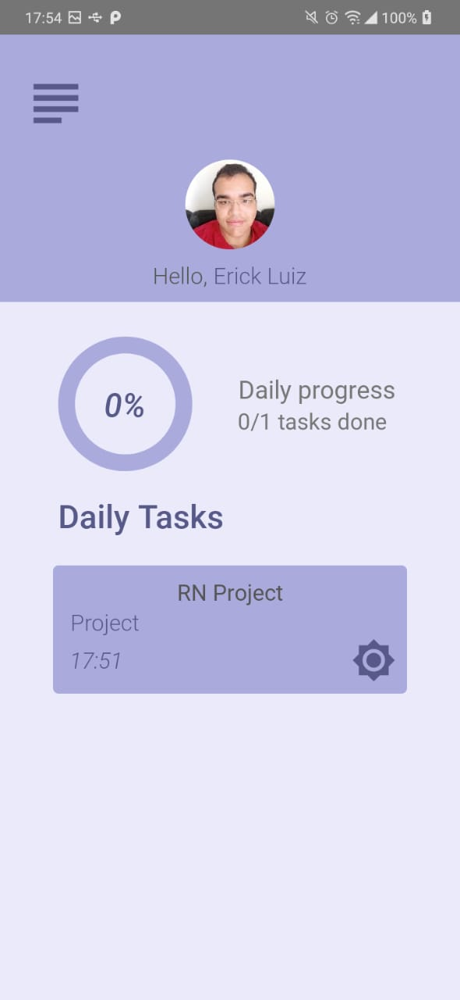

<p align="center"> 
  
</p>

<h1 align="center"> whtodo </h1>

<p align="center">
  <a href="https://github.com/ErickLuizA/whtodo/graphs/commit-activity" alt="Maintenance">
    
  </a>

  <a href="./LICENSE" alt="License: MIT">
    
  </a>

<br/>


<a href="https://github.com/ErickLuizA/whtodo/stargazers">
  
</a>

<p align="center">
  <a href="#clipboard-description">Description</a>&nbsp;&nbsp;&nbsp;|&nbsp;&nbsp;&nbsp;
  <a href="#building_construction-technologies">Technologies</a>&nbsp;&nbsp;&nbsp;|&nbsp;&nbsp;&nbsp;
  <a href="#rocket-getting-started">Getting Started</a>&nbsp;&nbsp;&nbsp;|&nbsp;&nbsp;&nbsp;
  <a href="#memo-license">License</a>&nbsp;&nbsp;&nbsp;|&nbsp;&nbsp;&nbsp;
  <a href="./.github"> Screenshots</a>
</p>

> Under construction

## :clipboard: Description

whtodo is a task noting app built with React Native and Firebase

## :building_construction: Technologies

- [Firebase](https://firebase.google.com)

- [Typescript](https://www.typescriptlang.org/)

- [React Native](https://reactnative.dev/)
  - [react-native-firebase](https://rnfirebase.io/)

## :rocket: Getting Started

## 1. Download the repository

```shell
 $ git clone https://github.com/ErickLuizA/whtodo.git
```

## 2. Installation

```shell
# Go into the repository
$ cd whtodo

# Install dependencies
$ yarn install

# Signin to firebase using your google account and configure your project -> https://console.firebase.google.com/

# Put your google.services.json file in the android/app folder or/and the respective if you are building for IOS

# Put your web client id in a .env file
```

## 3. Execution

```shell
$ yarn android or yarn ios

# Be aware that this project was configured only for android, check rnfirebase.io if any problem with firebase config

# Firestore data structure -> Users Collection -> Doc with user id as id -> Tasks Collection -> task docs 

$ yarn start
```

## :memo: License

This project is under the MIT license. See the file [LICENSE](LICENSE) for more details.

---

Build with 💙 By [Erick](https://erickluiz.netlify.app/)

